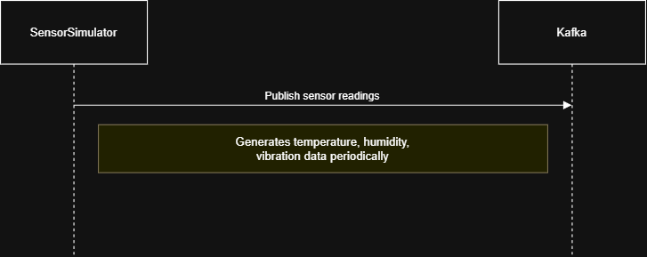
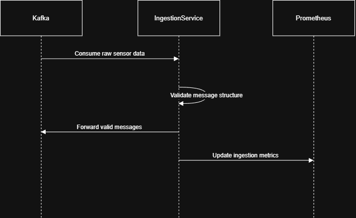
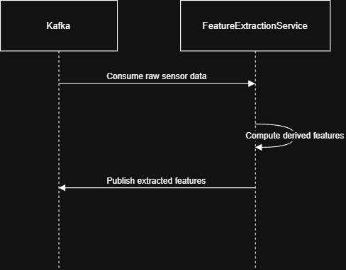
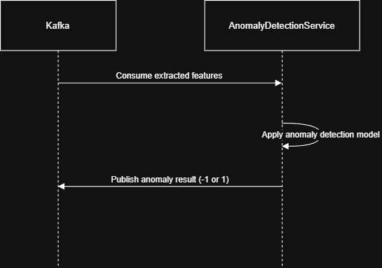
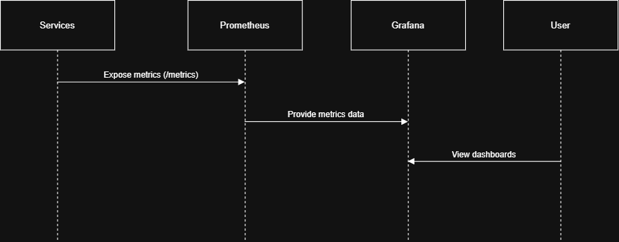

# AI-Architecture-and-Cloud-Computing

# Project Definition: 
## IOT-Anomaly-Detection-Platform:
This project implements a cloud-native, microservice-based IoT data processing pipeline that simulates sensor data,
ingests it using Apache Kafka, performs feature extraction, and detects anomalies using machine learning. 
The system is observable using Prometheus and Grafana and is deployable via Docker Compose or Kubernetes.

## Architecture Overview: 
System consists of microservices that communicate using Kafka topics. 
**Microservices:**
- Simulate Sensor
- Ingestion Service
- Feature Extraction
- Anomaly Detection
- Infrastructure:
  - Kafka
  - Kubernetes
  - Monitoring: 
    - prometheus
    - grafana

## Use cases: 
| **Use Case ID** | **Name**                      | **Description**                                                                                                                                                                           |
|-----------------|-------------------------------|-------------------------------------------------------------------------------------------------------------------------------------------------------------------------------------------|
| UC1             | Simulate Sensor Data          | Simulated IoT sensors generate data (e.g., temperature, humidity, vibration) at intervals for simulated locations and publish the readings as  messages to a Kafka topic.                 |
| UC2             | Data Ingestion and Validation | The ingestion service consumes raw sensor data from Kafka, tracks ingestion metrics, and forwards valid messages to feature extraction.                                                   |
| UC3             | Feature Extraction            | The feature extraction service transforms valid raw sensor readings into engineered features such as ratios and squared values, and publishes the data to a Kafka topic.                  |
| UC4             | Anomaly Detection             | The anomaly detection service applies a machine learning model to extracted features to classify sensor behavior as normal or anomalous, and publishes labeled results for visualization. |
| UC5             | Monitoring and Observability  | The system exposes operational and sustainability metrics, which are collected by Prometheus and visualized in Grafana dashboards to monitor performance, anomalies, and system health.   |

### Use Case Visualization: 
#### UC1: Simulate Sensor Data: 
Simulated IoT sensors generate data (e.g., temperature, humidity, vibration) at intervals for simulated locations and publish the readings as  messages to a Kafka topic. 

#### UC2: Data Ingestion and Validation: 
The ingestion service consumes raw sensor data from Kafka, tracks ingestion metrics, and forwards valid messages to feature extraction.         

#### UC3: Data Ingestion and Validation: 
The feature extraction service transforms raw sensor readings into engineered features such as ratios and squared values, and publishes the data to a Kafka topic.       

#### UC4: Anomaly Detection: 
The anomaly detection service applies a machine learning model to extracted features to classify sensor behavior as normal or anomalous, and publishes labeled results for visualization. 

#### UC5: Monitoring and Observability:
The system exposes operational and sustainability metrics, which are collected by Prometheus and visualized in Grafana dashboards to monitor performance, anomalies, and system health. 

## Application scaffolding: 
- simulator/: Sensor data generation
- ingestion-service/: Kafka consumer + FastAPI
- feature-extraction/: Feature engineering pipeline
- anomaly-detection/: ML-based anomaly detection (Isolation Forest)
- monitoring/: Prometheus , Grafana
- k8s/: Kubernetes deployment manifests??

##Monitoring & Observability

This project includes basic observability using **Prometheus** and **Grafana** to monitor the real-time IoT anomaly detection pipeline.

### Metrics Collection (Prometheus)
Each microservice exposes Prometheus metrics on a dedicated port:
- **Ingestion Service** → `:8001`
- **Feature Extraction Service** → `:8002`
- **Anomaly Detection Service** → `:8003`

Prometheus is configured to scrape all services and collect metrics such as:
- messages processed per second
- processing errors
- end-to-end processing latency

### Visualization (Grafana)
Grafana is connected to Prometheus as a data source and can be used to visualize:
- service health (`up` metrics)
- throughput across pipeline stages
- feature extraction and anomaly detection latency

An example **IoT Pipeline Overview** dashboard is included and automatically provisioned at startup.

### Access
- **Prometheus UI**: http://localhost:9090  
- **Grafana UI**:

