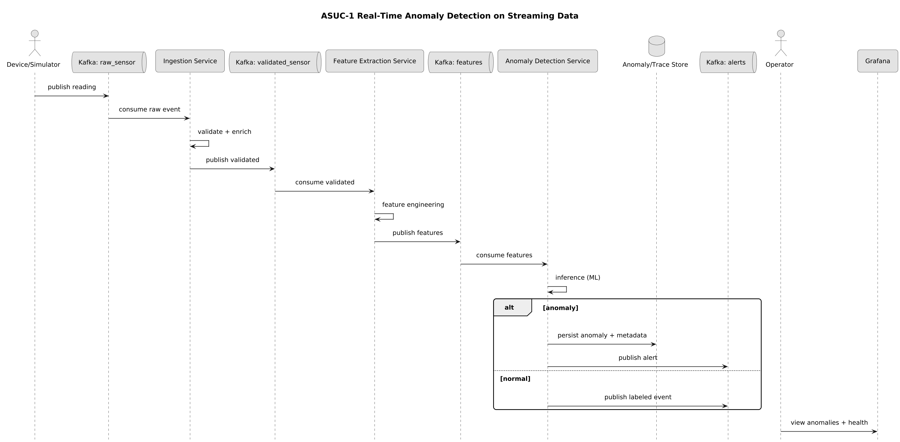
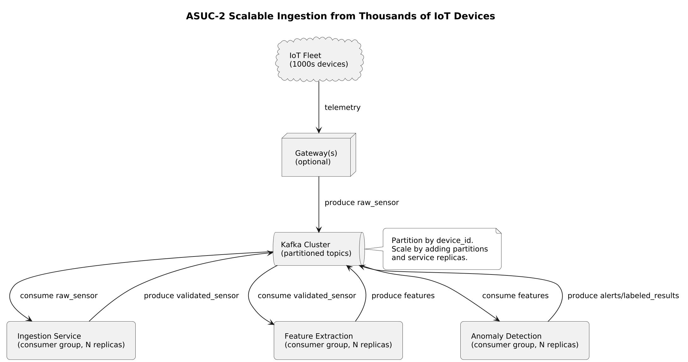
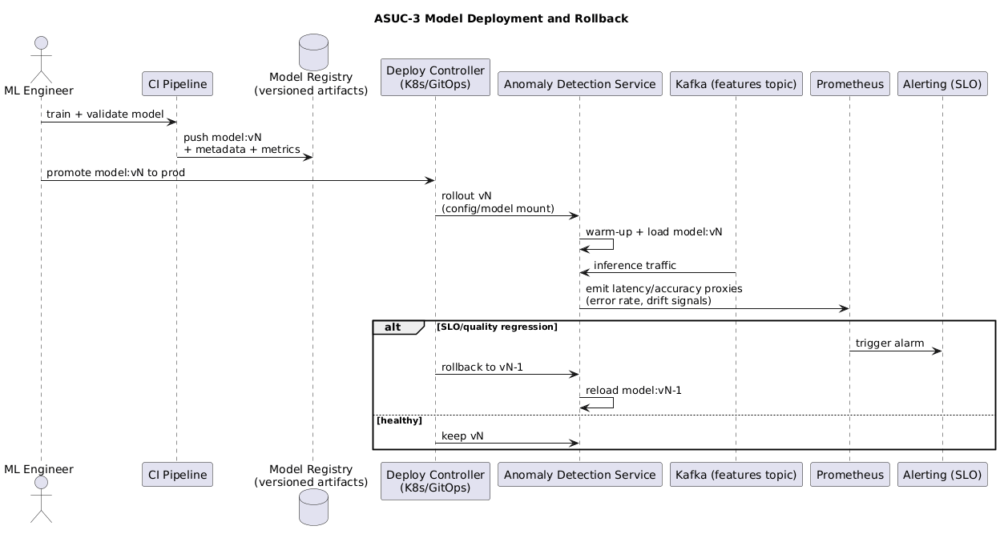
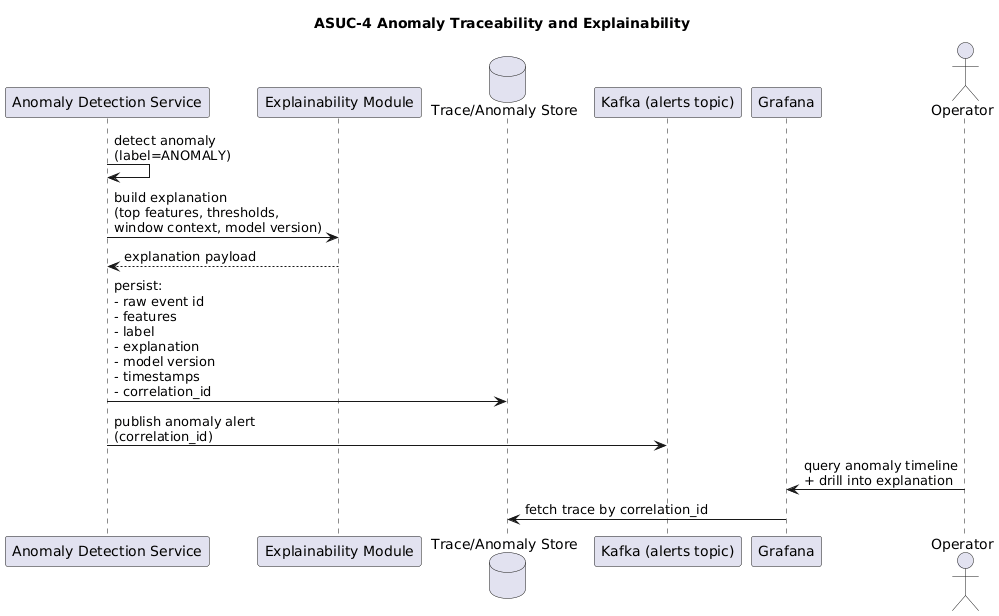
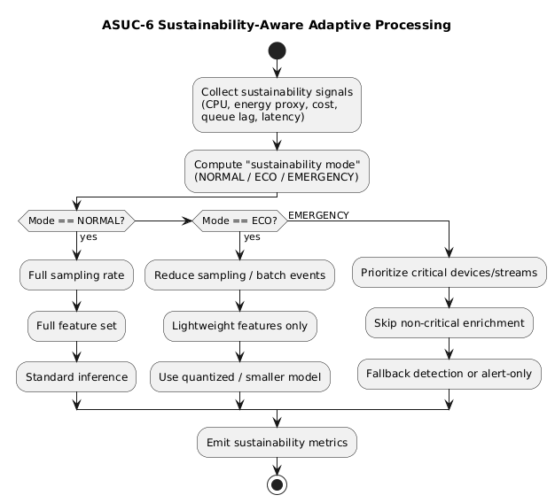
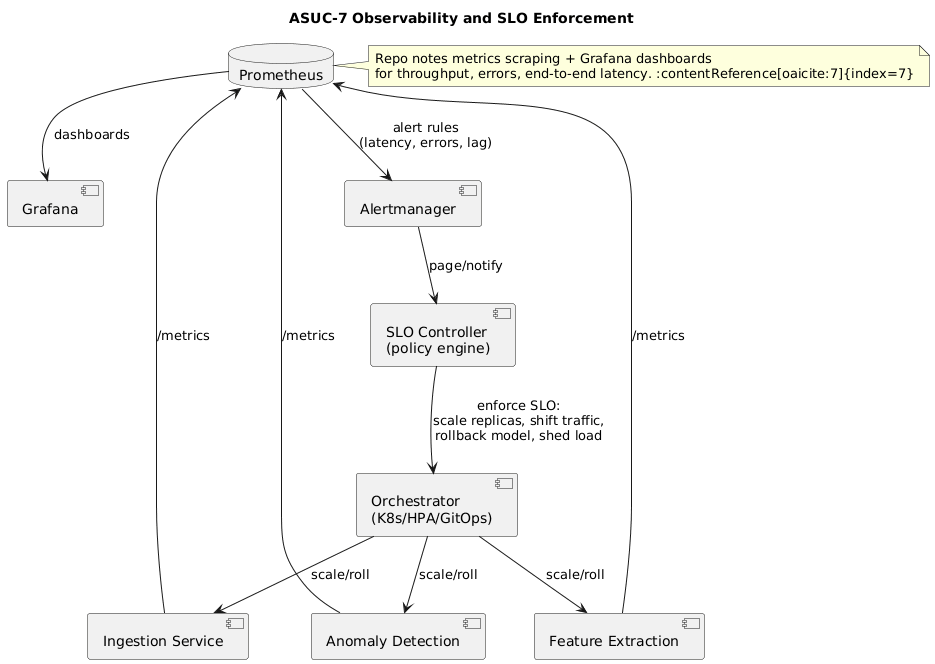
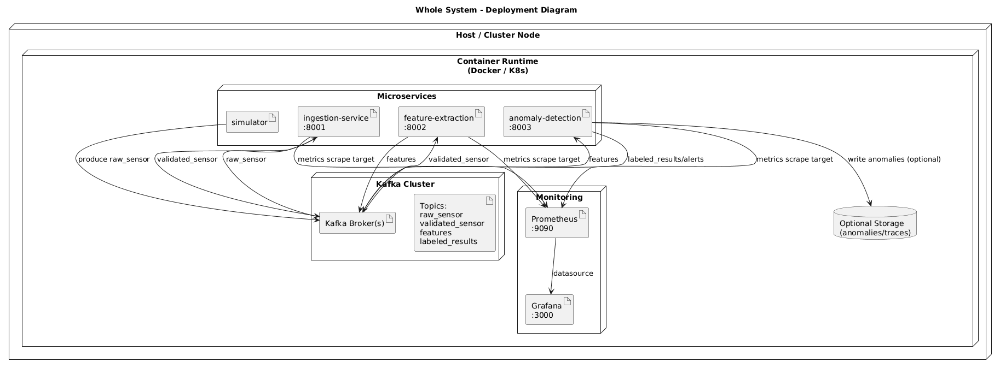

# AI-Architecture-and-Cloud-Computing

# Project Definition: 
## IOT-Anomaly-Detection-Platform:
This project implements a cloud-native, microservice-based IoT data processing pipeline that simulates sensor data,
ingests it using Apache Kafka, performs feature extraction, and detects anomalies using machine learning. 
The system is observable using Prometheus and Grafana and is deployable via Docker Compose or Kubernetes.

## Problem Definition

We are building an *Anomaly Detection System* to automatically identify unusual sensor patterns in IoT data.

This system is architecturally significant because it:
- Ingests streaming data at scale (Cloud integration)
- Applies ML-based anomaly detection (AI/ML component)
- Must be highly reliable and observable
- Influences resource usage & sustainability through adaptive processing

Primary Use Cases:
1. Detect anomalies in sensor streams in real-time
2. Alert stakeholders when anomalies affect operational thresholds
3. Log and trace anomalies for trend analysis and model improvement

## Architecture Overview: 
System consists of microservices that communicate using Kafka topics. 
**Microservices:**
- Simulate Sensor
- Ingestion Service
- Feature Extraction
- Anomaly Detection
- Infrastructure:
  - Kafka
  - Kubernetes
  - Monitoring: 
    - prometheus
    - grafana

## Use cases: 
| Use Case ID | Name | Description |
|------------|------|-------------|
| ASUC-1 | Real-Time Anomaly Detection on Streaming Data | The system processes continuous IoT sensor streams in real time, performs feature extraction and machine learning inference, and classifies incoming data as normal or anomalous with low latency. |
| ASUC-2 | Scalable Ingestion from Thousands of IoT Devices | The system ingests data from thousands of IoT devices concurrently using a scalable messaging backbone, ensuring high throughput, partitioned processing, and horizontal scalability. |
| ASUC-3 | Model Deployment and Rollback | The system supports versioned deployment of anomaly detection models, enabling safe rollout, monitoring, and rapid rollback to previous model versions in case of performance or reliability degradation. |
| ASUC-4 | Anomaly Traceability and Explainability | The system records anomaly decisions along with contextual metadata, feature values, and model information to allow operators to trace, audit, and understand why anomalies were detected. |
| ASUC-5 | Fault-Tolerant Operation under Partial Failure | The system continues operating under partial failures by applying retries, fallback modes, buffering, and dead-letter queues to prevent data loss and maintain service availability. |
| ASUC-6 | Sustainability-Aware Adaptive Processing | The system adapts processing strategies based on resource usage and sustainability signals, dynamically adjusting sampling rates, feature complexity, and model selection to reduce energy and cost. |
| ASUC-7 | Observability and SLO Enforcement | The system exposes operational metrics and service-level indicators that are monitored to enforce SLOs and trigger automated scaling, rollback, or degradation actions when thresholds are violated. |

### Use Case Visualization: 
#### ASUC-1: Real-Time Anomaly Detection on Streaming Data
The system processes streaming IoT sensor data in real time and classifies incoming readings as normal or anomalous using a machine learning model.

#### ASUC-2: Scalable Ingestion from Thousands of IoT Devices
The system ingests data from thousands of IoT devices concurrently using a scalable, partitioned Kafka-based messaging architecture.       

#### ASUC-3: Model Deployment and Rollback 
The system supports deploying new anomaly detection models and rolling back to previous versions when performance or reliability issues occur.    

#### ASUC-4: Anomaly Traceability and Explainability
The system stores anomaly results with contextual metadata to allow operators to trace and understand detected anomalies. 

#### ASUC-5: Fault-Tolerant Operation under Partial Failure
The system continues operating during partial failures by using retries, buffering, and fallback mechanisms to prevent data loss.

#### ASUC-6: Sustainability-Aware Adaptive Processing
The system continues operating during partial failures by using retries, buffering, and fallback mechanisms to prevent data loss.

#### ASUC-7: Observability and SLO Enforcement
The system continues operating during partial failures by using retries, buffering, and fallback mechanisms to prevent data loss.

## Component Diagram: 

## Application scaffolding: 
- simulator/: Sensor data generation
- ingestion-service/: Kafka consumer + FastAPI
- feature-extraction/: Feature engineering pipeline
- anomaly-detection/: ML-based anomaly detection (Isolation Forest)
- monitoring/: Prometheus , Grafana
- k8s/: Kubernetes deployment manifests??

## Monitoring & Observability

This project includes basic observability using **Prometheus** and **Grafana** to monitor the real-time IoT anomaly detection pipeline.

### Metrics Collection (Prometheus)
Each microservice exposes Prometheus metrics on a dedicated port:
- **Ingestion Service** → `:8001`
- **Feature Extraction Service** → `:8002`
- **Anomaly Detection Service** → `:8003`

Prometheus is configured to scrape all services and collect metrics such as:
- messages processed per second
- processing errors
- end-to-end processing latency

### Visualization (Grafana)
Grafana is connected to Prometheus as a data source and can be used to visualize:
- service health (`up` metrics)
- throughput across pipeline stages
- feature extraction and anomaly detection latency

An example **IoT Pipeline Overview** dashboard is included and automatically provisioned at startup.

### Access
- **Prometheus UI**: http://localhost:9090  
- **Grafana UI**: http://localhost:3000

### Sustainability
One of the ways we try to make sure our project was "sustainable" is a simple idea but could make a difference in how 
projects are done nowadays. We tried to achieve this by refactoring. By writing code that is well structured and as clean as 
possible we can already decrease the code carbon created by just existing code but not being used at all. This was an 
idea that was introduced to us in another lecture. And we tried to implement that with this project as well. 

